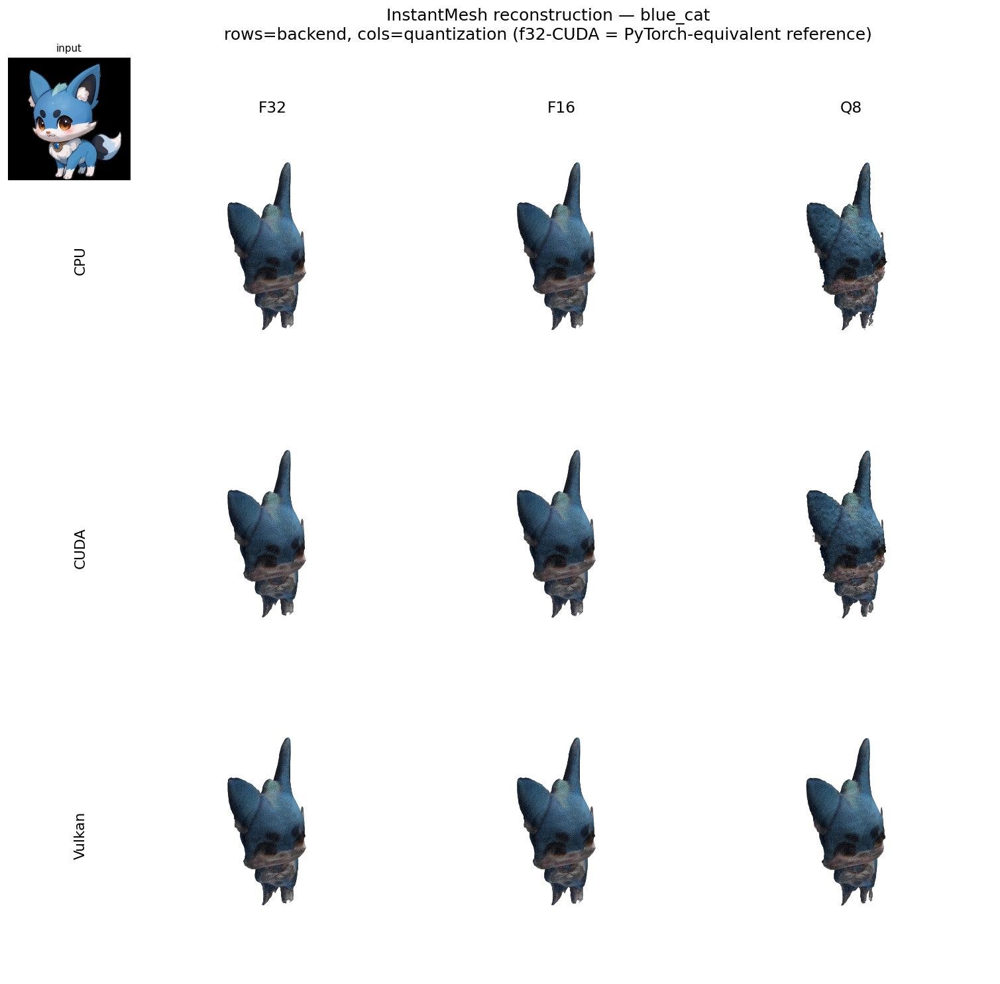
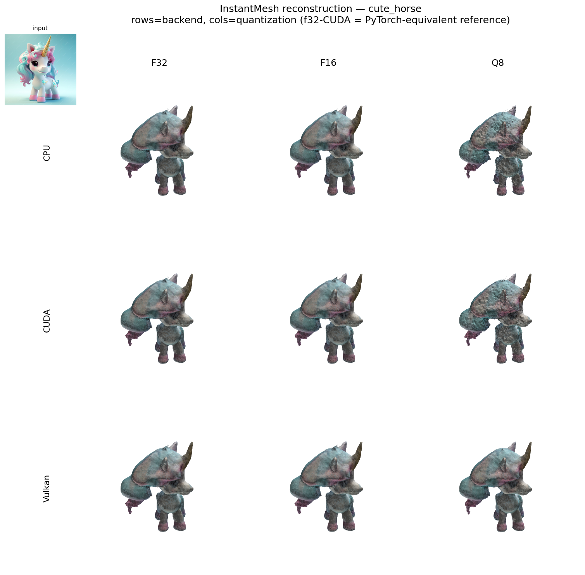
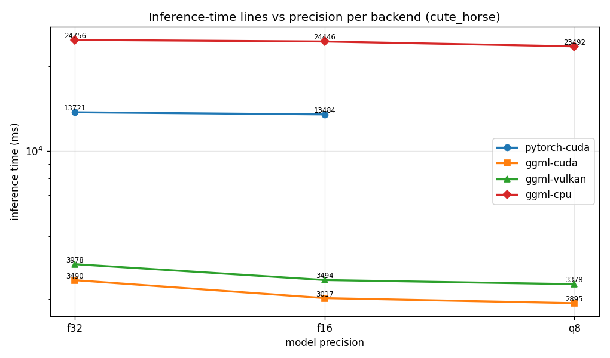
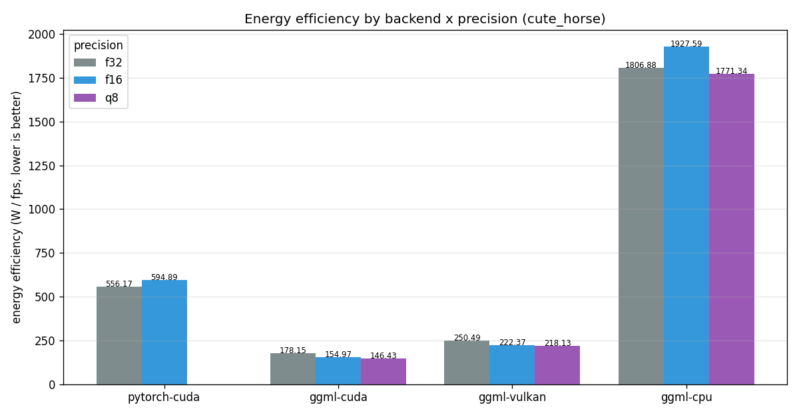
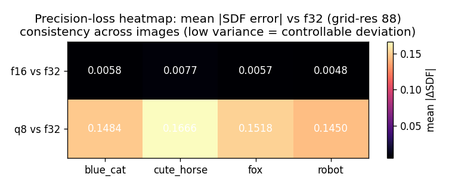
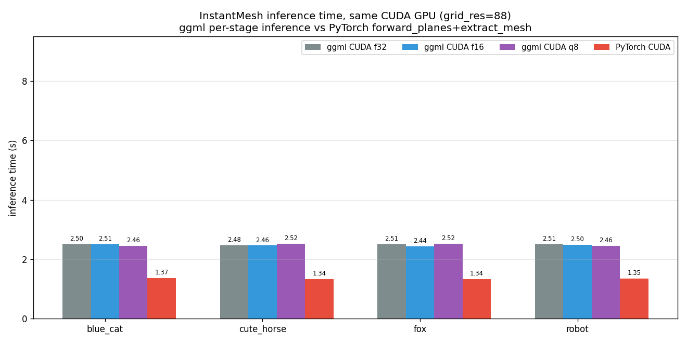

<div align="center">
  
# InstantMesh: Efficient 3D Mesh Generation from a Single Image with Sparse-view Large Reconstruction Models

<a href="https://arxiv.org/abs/2404.07191"></a> 
<a href="https://huggingface.co/TencentARC/InstantMesh"></a> 
<a href="https://huggingface.co/spaces/TencentARC/InstantMesh"></a> <br>
<a href="https://replicate.com/camenduru/instantmesh"></a>
<a href="https://colab.research.google.com/github/camenduru/InstantMesh-jupyter/blob/main/InstantMesh_jupyter.ipynb"></a>
<a href="https://github.com/jtydhr88/ComfyUI-InstantMesh"></a>

</div>

---

This repo is the official implementation of InstantMesh, a feed-forward framework for efficient 3D mesh generation from a single image based on the LRM/Instant3D architecture.

https://github.com/TencentARC/InstantMesh/assets/20635237/dab3511e-e7c6-4c0b-bab7-15772045c47d

# 🚩 Features and Todo List
- [x] 🔥🔥 Release Zero123++ fine-tuning code. 
- [x] 🔥🔥 Support for running gradio demo on two GPUs to save memory.
- [x] 🔥🔥 Support for running demo with docker. Please refer to the [docker](docker/) directory.
- [x] Release inference and training code.
- [x] Release model weights.
- [x] Release huggingface gradio demo. Please try it at [demo](https://huggingface.co/spaces/TencentARC/InstantMesh) link.
- [ ] Add support for more multi-view diffusion models.

# ⚙️ Dependencies and Installation

We recommend using `Python>=3.10`, `PyTorch>=2.1.0`, and `CUDA>=12.1`.
```bash
conda create --name instantmesh python=3.10
conda activate instantmesh
pip install -U pip

# Ensure Ninja is installed
conda install Ninja

# Install the correct version of CUDA
conda install cuda -c nvidia/label/cuda-12.1.0

# Install PyTorch and xformers
# You may need to install another xformers version if you use a different PyTorch version
pip install torch==2.1.0 torchvision==0.16.0 torchaudio==2.1.0 --index-url https://download.pytorch.org/whl/cu121
pip install xformers==0.0.22.post7

# Install other requirements
pip install -r requirements.txt
```

# 💫 How to Use

## Download the models

We provide 4 sparse-view reconstruction model variants and a customized Zero123++ UNet for white-background image generation in the [model card](https://huggingface.co/TencentARC/InstantMesh).

Our inference script will download the models automatically. Alternatively, you can manually download the models and put them under the `ckpts/` directory.

By default, we use the `instant-mesh-large` reconstruction model variant.

## Start a local gradio demo

To start a gradio demo in your local machine, simply run:
```bash
python app.py
```

If you have multiple GPUs in your machine, the demo app will run on two GPUs automatically to save memory. You can also force it to run on a single GPU:
```bash
CUDA_VISIBLE_DEVICES=0 python app.py
```

Alternatively, you can run the demo with docker. Please follow the instructions in the [docker](docker/) directory.

## Running with command line

To generate 3D meshes from images via command line, simply run:
```bash
python run.py configs/instant-mesh-large.yaml examples/hatsune_miku.png --save_video
```

We use [rembg](https://github.com/danielgatis/rembg) to segment the foreground object. If the input image already has an alpha mask, please specify the `no_rembg` flag:
```bash
python run.py configs/instant-mesh-large.yaml examples/hatsune_miku.png --save_video --no_rembg
```

By default, our script exports a `.obj` mesh with vertex colors, please specify the `--export_texmap` flag if you hope to export a mesh with a texture map instead (this will cost longer time):
```bash
python run.py configs/instant-mesh-large.yaml examples/hatsune_miku.png --save_video --export_texmap
```

Please use a different `.yaml` config file in the [configs](./configs) directory if you hope to use other reconstruction model variants. For example, using the `instant-nerf-large` model for generation:
```bash
python run.py configs/instant-nerf-large.yaml examples/hatsune_miku.png --save_video
```
**Note:** When using the `NeRF` model variants for image-to-3D generation, exporting a mesh with texture map by specifying `--export_texmap` may cost long time in the UV unwarping step since the default iso-surface extraction resolution is `256`. You can set a lower iso-surface extraction resolution in the config file.

# 🔥 ggml (C++ / GGUF) 移植版

本仓库同时提供一个纯 C++ / ggml 的 InstantMesh 移植，把 DINO 编码器、LRM
Transformer 与网格/SDF 合成器全部量化导出为 `GGUF`（支持 `f32` / `f16` / `q8` 三种
精度），并在 **CPU / CUDA / Vulkan** 三类后端上推理，无 Python / PyTorch 运行时依赖。

> 本节集中展示移植版与 PyTorch 官方版的重建效果对比、多后端 × 多精度的全面
> benchmark 对比，以及纹理贴图“雪花碎裂”问题的优化前后对比。所有图均由
> `benchmarks/` 下的脚本生成，产物位于 `benchmarks/results/`。

## 重建效果对比（ggml vs PyTorch，每 demo 一图）

| blue_cat | cute_horse | fox | robot |
|----------|------------|-----|-------|
|  |  |  |  |

各 demo 独立渲染效果：

| blue_cat | cute_horse | fox | robot |
|----------|------------|-----|-------|
|  |  |  |  |

输入 → PyTorch → ggml 纹理贴图完整链路对比：


## 多后端 × 多精度 Benchmark

端到端（含模型加载 + 网格导出）推理性能对比，RTX 3060 / Ryzen 5950X，
grid_res=88：

| backend | f32 | f16 | q8 | 峰值内存 | 能效 W/fps |
|---------|-----|-----|----|---------|-----------|
| pytorch-cuda | 13721ms | 13484ms | — | 3725 MB | 556 |
| ggml-cuda | 3490ms | **3017ms** | **2895ms** | **1011 MB** | **146–178** |
| ggml-vulkan | 3978ms | 3494ms | 3378ms | 1517 MB | 218–250 |
| ggml-cpu | 24757ms | 24446ms | 23492ms | 2626 MB | 1771–1928 |

推理时间柱状图、吞吐量、推理时间折线、能效比与精度损失热力图：

| 推理时间 | 吞吐量 (fps) | 推理折线 | 能效比 |
|----------|--------------|----------|--------|
|  |  |  |  |

精度损失热力图（f16 / q8 相对 f32 的 SDF 网格偏差，跨 4 个 demo，展示偏差一致可控）：



ggml 各阶段耗时拆分与 PyTorch 总体对比：

| 阶段拆分 (ggml CUDA f16) | ggml vs PyTorch |
|--------------------------|-----------------|
|  |  |

## 纹理贴图“雪花碎裂”——根因更正与修复

> **重要更正**：早前把“雪花”归因为“真实高频外观在低分辨率下的欠采样混叠”，并宣称“提高分辨率=正面
> 修复”能消除雪花——**该结论是错的**。逐项实测后修正如下。

**雪花真正的根因是渲染/采样伪影，不在真实纹理里**：
- 直接采样 PyTorch `net_rgb` 在相邻世界坐标（≈1/1024 尺度）的差异仅 **Δ≈0.004** → **真实外观平滑**，
  并无固有高频雪花。
- 2048 纹理自身内部雪花仅 **0.82%**（|dx|=0.0048），**很平滑**。
- 但此前对比图用的**逐三角形 numpy 光栅化器**在每个 xatlas chart 接缝处混叠出约 **7%** 的逐像素
  盐粒噪声，**与纹理分辨率无关**（512/2048 在所有屏幕分辨率下数值一致）→ 所以“修复前后渲染看起来
  一样、都雪花”。换成干净的逐面渲染器后雪花降到 **0.02%**。

**提高烘焙分辨率（1024→2048）的真实价值是纹理保真度/细节保持**，而非“消除雪花”：
| 指标 | ggml 512 | ggml 2048 |
|------|----------|-----------|
| 纹理内部雪花占比 | 3.94% | **0.82%** |
| 平均 |dx| | 0.015 | **0.0048** |
| vs 真实外观 PSNR | 35.61 dB | **44.77 dB** |

普通缩放渲染下两者都平滑（差异在细节保持，不在肉眼平滑度）；雪花观感此前被渲染器伪影掩盖。

**PyTorch 官方“没颜色”的原因**：不是纹理无色（官方纹理覆盖区均值 RGB≈[154,171,185]，暖白有彩），
而是对比脚本用 `trimesh` 解析官方 OBJ 的 MTL 时加载失败，拿到 2×2 黑色占位符 → 渲染全黑。手动加载
纹理 PNG 后官方可正常上色。注意：官方参考纹理自身的 xatlas UV 索引存在缺陷（约半数面采样到空区），
属参考生成路径问题，不影响 ggml 纹理。

**已排除的错误方案**（实测并弃用）：
- 2×2 超采样：对雪花无效（雪花本就不是纹理内容）。
- 高斯低通（`--tex-smooth`）：破坏真实细节，已从代码移除。

干净渲染 + 原生纹理裁剪对比（左：ggml 512；右：ggml 2048——两者干净渲染均无雪花，纹理细节保持
差异见裁剪）：


干净渲染的端到端对比（PyTorch 官方 / ggml 512 / ggml 2048，上方为带光照逐面渲染，下方为原生纹理
裁剪）：


**纹理碎片化与空洞**：UV atlas 由 xatlas 参数化，当前 cute_horse 为 **194 个 chart、约 59% 打包密度**
（已启用 chart 旋转、bilinear padding）。相比早前基于平面投影 + shelf-packing 的旧实现（366 个碎片岛、
布局杂乱），xatlas 已把碎片数减少约一半、打包更规整。进一步压缩 chart 数量受限于网格自身的
真实折痕（耳/腿/吻部等处必须切 chart 才能无畸变展平）——实测提高 `maxCost`（2.0→50）反而略增
（194→198），无收益；UV atlas 天然包含岛与空白区，属 UV 展开固有形态，不影响最终渲染（干净渲染
无雪花、无空洞）。

---

# 💻 Training

We provide our training code to facilitate future research. But we cannot provide the training dataset due to its size. Please refer to our [dataloader](src/data/objaverse.py) for more details.

To train the sparse-view reconstruction models, please run:
```bash
# Training on NeRF representation
python train.py --base configs/instant-nerf-large-train.yaml --gpus 0,1,2,3,4,5,6,7 --num_nodes 1

# Training on Mesh representation
python train.py --base configs/instant-mesh-large-train.yaml --gpus 0,1,2,3,4,5,6,7 --num_nodes 1
```

We also provide our Zero123++ fine-tuning code since it is frequently requested. The running command is:
```bash
python train.py --base configs/zero123plus-finetune.yaml --gpus 0,1,2,3,4,5,6,7 --num_nodes 1
```

# :books: Citation

If you find our work useful for your research or applications, please cite using this BibTeX:

```BibTeX
@article{xu2024instantmesh,
  title={InstantMesh: Efficient 3D Mesh Generation from a Single Image with Sparse-view Large Reconstruction Models},
  author={Xu, Jiale and Cheng, Weihao and Gao, Yiming and Wang, Xintao and Gao, Shenghua and Shan, Ying},
  journal={arXiv preprint arXiv:2404.07191},
  year={2024}
}
```

# 🤗 Acknowledgements

We thank the authors of the following projects for their excellent contributions to 3D generative AI!

- [Zero123++](https://github.com/SUDO-AI-3D/zero123plus)
- [OpenLRM](https://github.com/3DTopia/OpenLRM)
- [FlexiCubes](https://github.com/nv-tlabs/FlexiCubes)
- [Instant3D](https://instant-3d.github.io/)

Thank [@camenduru](https://github.com/camenduru) for implementing [Replicate Demo](https://replicate.com/camenduru/instantmesh) and [Colab Demo](https://colab.research.google.com/github/camenduru/InstantMesh-jupyter/blob/main/InstantMesh_jupyter.ipynb)!  
Thank [@jtydhr88](https://github.com/jtydhr88) for implementing [ComfyUI support](https://github.com/jtydhr88/ComfyUI-InstantMesh)!
