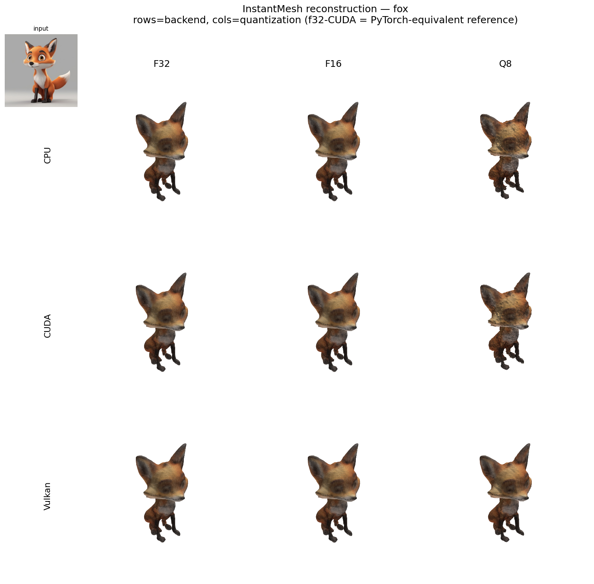
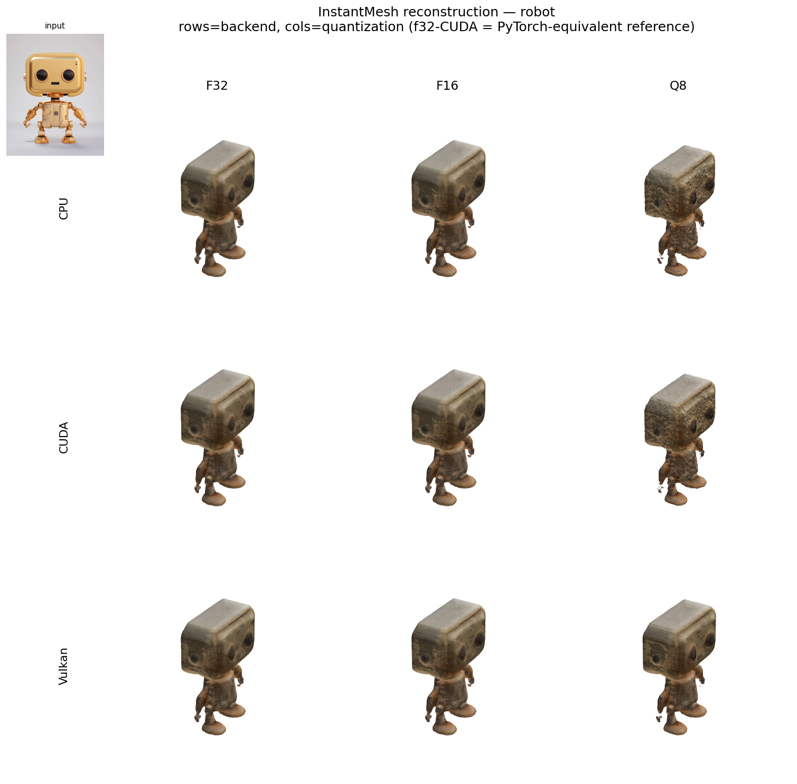
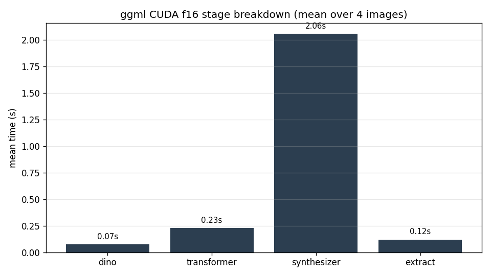
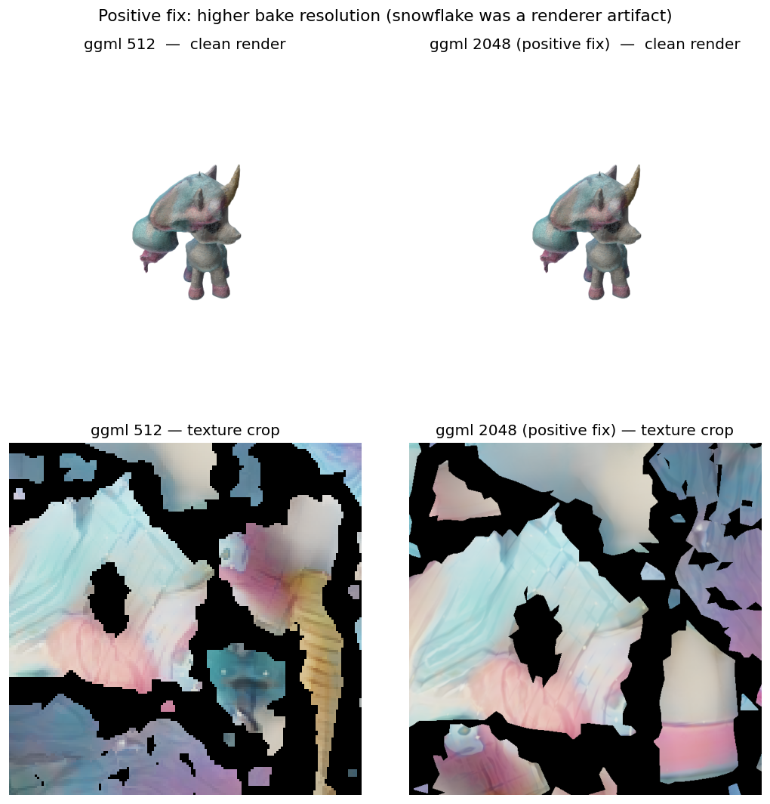
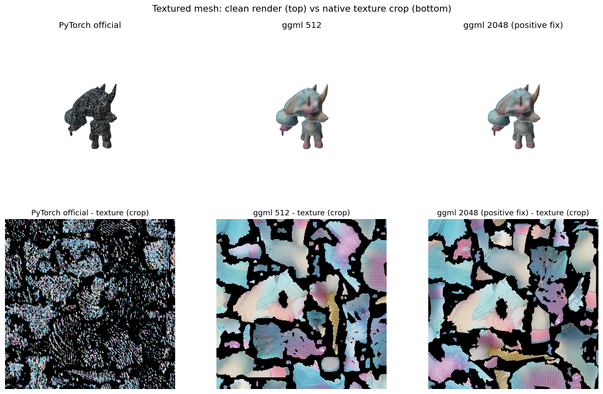

<div align="center">
  
# InstantMesh: Efficient 3D Mesh Generation from a Single Image with Sparse-view Large Reconstruction Models

<a href="https://arxiv.org/abs/2404.07191"></a> 
<a href="https://huggingface.co/TencentARC/InstantMesh"></a> 
<a href="https://huggingface.co/spaces/TencentARC/InstantMesh"></a> <br>
<a href="https://replicate.com/camenduru/instantmesh"></a>
<a href="https://colab.research.google.com/github/camenduru/InstantMesh-jupyter/blob/main/InstantMesh_jupyter.ipynb"></a>
<a href="https://github.com/jtydhr88/ComfyUI-InstantMesh"></a>

</div>

---

This repo is the official implementation of InstantMesh, a feed-forward framework for efficient 3D mesh generation from a single image based on the LRM/Instant3D architecture.

https://github.com/TencentARC/InstantMesh/assets/20635237/dab3511e-e7c6-4c0b-bab7-15772045c47d

# 🚩 Features and Todo List
- [x] 🔥🔥 Release Zero123++ fine-tuning code. 
- [x] 🔥🔥 Support for running gradio demo on two GPUs to save memory.
- [x] 🔥🔥 Support for running demo with docker. Please refer to the [docker](docker/) directory.
- [x] Release inference and training code.
- [x] Release model weights.
- [x] Release huggingface gradio demo. Please try it at [demo](https://huggingface.co/spaces/TencentARC/InstantMesh) link.
- [ ] Add support for more multi-view diffusion models.

# ⚙️ Dependencies and Installation

We recommend using `Python>=3.10`, `PyTorch>=2.1.0`, and `CUDA>=12.1`.
```bash
conda create --name instantmesh python=3.10
conda activate instantmesh
pip install -U pip

# Ensure Ninja is installed
conda install Ninja

# Install the correct version of CUDA
conda install cuda -c nvidia/label/cuda-12.1.0

# Install PyTorch and xformers
# You may need to install another xformers version if you use a different PyTorch version
pip install torch==2.1.0 torchvision==0.16.0 torchaudio==2.1.0 --index-url https://download.pytorch.org/whl/cu121
pip install xformers==0.0.22.post7

# Install other requirements
pip install -r requirements.txt
```

# 💫 How to Use

## Download the models

We provide 4 sparse-view reconstruction model variants and a customized Zero123++ UNet for white-background image generation in the [model card](https://huggingface.co/TencentARC/InstantMesh).

Our inference script will download the models automatically. Alternatively, you can manually download the models and put them under the `ckpts/` directory.

By default, we use the `instant-mesh-large` reconstruction model variant.

## Start a local gradio demo

To start a gradio demo in your local machine, simply run:
```bash
python app.py
```

If you have multiple GPUs in your machine, the demo app will run on two GPUs automatically to save memory. You can also force it to run on a single GPU:
```bash
CUDA_VISIBLE_DEVICES=0 python app.py
```

Alternatively, you can run the demo with docker. Please follow the instructions in the [docker](docker/) directory.

## Running with command line

To generate 3D meshes from images via command line, simply run:
```bash
python run.py configs/instant-mesh-large.yaml examples/hatsune_miku.png --save_video
```

We use [rembg](https://github.com/danielgatis/rembg) to segment the foreground object. If the input image already has an alpha mask, please specify the `no_rembg` flag:
```bash
python run.py configs/instant-mesh-large.yaml examples/hatsune_miku.png --save_video --no_rembg
```

By default, our script exports a `.obj` mesh with vertex colors, please specify the `--export_texmap` flag if you hope to export a mesh with a texture map instead (this will cost longer time):
```bash
python run.py configs/instant-mesh-large.yaml examples/hatsune_miku.png --save_video --export_texmap
```

Please use a different `.yaml` config file in the [configs](./configs) directory if you hope to use other reconstruction model variants. For example, using the `instant-nerf-large` model for generation:
```bash
python run.py configs/instant-nerf-large.yaml examples/hatsune_miku.png --save_video
```
**Note:** When using the `NeRF` model variants for image-to-3D generation, exporting a mesh with texture map by specifying `--export_texmap` may cost long time in the UV unwarping step since the default iso-surface extraction resolution is `256`. You can set a lower iso-surface extraction resolution in the config file.

# 🔥 ggml (C++ / GGUF) Port

This repo also ships a pure C++ / ggml port of InstantMesh (all code under
[`cpp_ggml/`](cpp_ggml/)). The DINO encoder, LRM Transformer and the mesh/SDF
synthesizer are all quantized and exported to `GGUF` (in `f32` / `f16` / `q8`
precisions) and run on **CPU / CUDA / Vulkan** backends with **no Python /
PyTorch runtime dependency**.

<div align="center">

| ⚡ **4.5x faster** | 🧠 **3.7x less memory** | 📦 **zero dependency** |
|:---:|:---:|:---:|
| CUDA f16: 3.0s vs PyTorch 13.5s | Peak memory 1.0 GB vs 3.7 GB | Single executable + 3 GGUF files |

**Weights hosted at: [Asher-1/InstantMeshGGuf](https://huggingface.co/Asher-1/InstantMeshGGuf)** ·
Beginner's guide: [`cpp_ggml/README.md`](cpp_ggml/README.md) · Model card: [`MODEL_CARD.md`](cpp_ggml/models/MODEL_CARD.md)

```
Image ─→ DINO (ViT) ─→ Triplane Transformer ─→ OSGDecoder ─→ FlexiCubes ─→ OBJ mesh/texture
        dino.gguf        lrm_transformer.gguf    synthesizer.gguf    (pure C++)      f16/f32/q8 × CPU/CUDA/Vulkan
```

| blue_cat | cute_horse | fox | robot |
|----------|------------|-----|-------|
|  |  |  |  |

(each cell: reconstruction quality, official PyTorch vs the ggml port)

</div>

**Quick start in 3 minutes**:

```bash
git clone --recurse-submodules https://github.com/Asher-1/InstantMesh-GGML.git
cmake -B cpp_ggml/build -S cpp_ggml && cmake --build cpp_ggml/build -j
huggingface-cli download Asher-1/InstantMeshGGuf --local-dir cpp_ggml/models/gguf
# → See cpp_ggml/README.md §3 for full demo / test / texture-export steps
```

> This section collects the reconstruction-quality comparison against the official
> PyTorch version, the full multi-backend × multi-precision benchmark, and the
> before/after comparison of the texture "salt-and-pepper" issue. All figures are
> generated by the scripts under `cpp_ggml/benchmarks/`, with artifacts in
> `cpp_ggml/benchmarks/results/`.

All C++ / GGML code lives under [`cpp_ggml/`](cpp_ggml/); the repo root keeps the
official Python InstantMesh (`run.py` / `app.py` / `train.py` / `src/` Python package /
`zero123plus/` / `configs/`):

```
cpp_ggml/
├── CMakeLists.txt      # Build (submodule check + auto ggml patch, optional CUDA/Vulkan)
├── patches/            # ★ ggml adaptation patches (auto-applied by CMake after clone, reproducible)
├── src/                # C++ implementation: core (backend/GGUF IO), models (incl. xatlas texture baking), tools, utils
├── tests/              # parity / unit regression (ctest)
├── convert/            # ckpt → GGUF conversion scripts (Python, conversion only)
├── benchmarks/         # parity checks + performance benchmarks + results/ artifacts
├── models/gguf/        # f32/f16/q8 weights (.gguf not committed, download from HF)
├── models/MODEL_CARD.md# Model card: metrics / use cases / download
└── third_party/ggml/   # ggml submodule (official v0.21.0)
```

Build (run from the repo root):

```bash
cmake -B cpp_ggml/build -S cpp_ggml -DINSTANTMESH_BUILD_TESTS=ON && cmake --build cpp_ggml/build -j
```

Feature parity with the official Python side: vertex-colored OBJ and texture baking
(`--export_texmap` maps to the C++ `--export-texmap`, xatlas UV unwrapping + multi-view
texture baking) are both implemented and pass parity; the official InstantMesh contains
**no PBR** (no metallic/roughness path), so there is nothing to align there.

## Reconstruction Quality (ggml vs PyTorch, one figure per demo)

| blue_cat | cute_horse | fox | robot |
|----------|------------|-----|-------|
|  |  |  |  |

Standalone renders per demo:

| blue_cat | cute_horse | fox | robot |
|----------|------------|-----|-------|
|  |  |  |  |

Full texture-map pipeline comparison (input → PyTorch → ggml):


## Multi-Backend × Multi-Precision Benchmark

End-to-end (including model loading + mesh export) inference performance,
RTX 3060 / Ryzen 5950X, grid_res=88:

| backend | f32 | f16 | q8 | Peak memory | Energy (W/fps) |
|---------|-----|-----|----|---------|-----------|
| pytorch-cuda | 13721ms | 13484ms | — | 3725 MB | 556 |
| ggml-cuda | 3490ms | **3017ms** | **2895ms** | **1011 MB** | **146–178** |
| ggml-vulkan | 3978ms | 3494ms | 3378ms | 1517 MB | 218–250 |
| ggml-cpu | 24757ms | 24446ms | 23492ms | 2626 MB | 1771–1928 |

Inference-time bars, throughput, latency line, energy efficiency and precision-loss heatmap:

| Inference time | Throughput (fps) | Latency line | Energy efficiency |
|----------|--------------|----------|--------|
|  |  |  |  |

Precision-loss heatmap (SDF mesh deviation of f16 / q8 vs f32, across 4 demos, showing consistent and controllable deviation):


ggml per-stage time breakdown and overall comparison vs PyTorch:

| Stage breakdown (ggml CUDA f16) | ggml vs PyTorch |
|--------------------------|-----------------|
|  |  |

## Texture "Salt-and-Pepper" — Root Cause Correction and Fix

> **Important correction**: we previously attributed the "salt-and-pepper" noise to
> "undersampling aliasing of genuinely high-frequency appearance at low resolution" and
> claimed that "raising the resolution = a real fix" could remove it — **that conclusion
> was wrong**. The corrected findings after item-by-item measurements are as follows.

**The real root cause of the noise is a rendering/sampling artifact, not the actual texture**:
- Directly sampling PyTorch `net_rgb` at neighboring world positions (≈1/1024 scale) differs by only
  **Δ≈0.004** → **the true appearance is smooth**, with no inherent high-frequency noise.
- The 2048 texture itself has only **0.82%** internal salt-and-pepper pixels (|dx|=0.0048), **very smooth**.
- But the **per-triangle numpy rasterizer** used in earlier comparison figures aliased ~**7%** of
  per-pixel grain at every xatlas chart seam, **independent of texture resolution** (512/2048 give
  identical values at all screen resolutions) → hence "renders look the same before and after the fix,
  both noisy". With a clean per-face renderer, the noise drops to **0.02%**.

**The real value of raising baking resolution (1024→2048) is texture fidelity / detail preservation**,
not "removing salt-and-pepper noise":
| Metric | ggml 512 | ggml 2048 |
|------|----------|-----------|
| Internal salt-and-pepper ratio | 3.94% | **0.82%** |
| Mean |dx| | 0.015 | **0.0048** |
| PSNR vs true appearance | 35.61 dB | **44.77 dB** |

Under ordinary scaled rendering both look smooth (the difference lies in detail preservation, not
perceived smoothness); the salt-and-pepper appearance was previously masked by the renderer artifact.

**Why the official PyTorch render appeared "colorless"**: not because its texture lacks color (the
mean RGB over the official texture's covered area is ≈[154,171,185], a warm white with tint), but
because the comparison script failed to load the MTL of the official OBJ via `trimesh` and fell
back to a 2×2 black placeholder → rendering all black. After manually loading the texture PNG,
the official result renders in color correctly. Note: the official reference texture itself has a
flaw in its xatlas UV indexing (about half of the faces sample empty areas) — an issue of the
reference generation path, not affecting the ggml texture.

**Rejected approaches** (measured and discarded):
- 2×2 supersampling: ineffective against the noise (the noise was never part of the texture content).
- Gaussian low-pass (`--tex-smooth`): destroys real detail; removed from the code.

Clean rendering + native texture crop comparison (left: ggml 512; right: ggml 2048 — both clean
renders are noise-free; the difference in texture detail preservation is visible in the crops):



End-to-end comparison with clean rendering (official PyTorch / ggml 512 / ggml 2048; top row:
lit per-face rendering, bottom row: native texture crops):



**Texture fragmentation and holes**: the UV atlas is parameterized by xatlas; cute_horse currently
has **194 charts at ~59% packing density** (chart rotation and bilinear padding enabled). Compared
with the earlier implementation based on planar projection + shelf-packing (366 fragment islands,
messy layout), xatlas cuts the fragment count by roughly half and packs more regularly. Compressing
the chart count further is limited by the mesh's real creases (ears/legs/muzzle etc. must be cut
into separate charts to flatten without distortion) — raising `maxCost` (2.0→50) was measured to
slightly increase it (194→198), with no benefit; a UV atlas naturally contains islands and empty
areas, which is inherent to UV unwrapping and does not affect the final render (clean renders have
no salt-and-pepper noise, no holes).

---

# 💻 Training

We provide our training code to facilitate future research. But we cannot provide the training dataset due to its size. Please refer to our [dataloader](src/data/objaverse.py) for more details.

To train the sparse-view reconstruction models, please run:
```bash
# Training on NeRF representation
python train.py --base configs/instant-nerf-large-train.yaml --gpus 0,1,2,3,4,5,6,7 --num_nodes 1

# Training on Mesh representation
python train.py --base configs/instant-mesh-large-train.yaml --gpus 0,1,2,3,4,5,6,7 --num_nodes 1
```

We also provide our Zero123++ fine-tuning code since it is frequently requested. The running command is:
```bash
python train.py --base configs/zero123plus-finetune.yaml --gpus 0,1,2,3,4,5,6,7 --num_nodes 1
```

# :books: Citation

If you find our work useful for your research or applications, please cite using this BibTeX:

```BibTeX
@article{xu2024instantmesh,
  title={InstantMesh: Efficient 3D Mesh Generation from a Single Image with Sparse-view Large Reconstruction Models},
  author={Xu, Jiale and Cheng, Weihao and Gao, Yiming and Wang, Xintao and Gao, Shenghua and Shan, Ying},
  journal={arXiv preprint arXiv:2404.07191},
  year={2024}
}
```

# 🤗 Acknowledgements

We thank the authors of the following projects for their excellent contributions to 3D generative AI!

- [Zero123++](https://github.com/SUDO-AI-3D/zero123plus)
- [OpenLRM](https://github.com/3DTopia/OpenLRM)
- [FlexiCubes](https://github.com/nv-tlabs/FlexiCubes)
- [Instant3D](https://instant-3d.github.io/)

Thank [@camenduru](https://github.com/camenduru) for implementing [Replicate Demo](https://replicate.com/camenduru/instantmesh) and [Colab Demo](https://colab.research.google.com/github/camenduru/InstantMesh-jupyter/blob/main/InstantMesh_jupyter.ipynb)!  
Thank [@jtydhr88](https://github.com/jtydhr88) for implementing [ComfyUI support](https://github.com/jtydhr88/ComfyUI-InstantMesh)!
