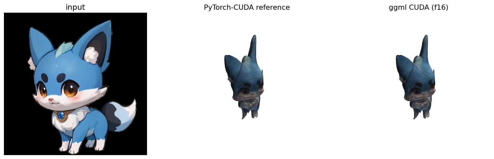
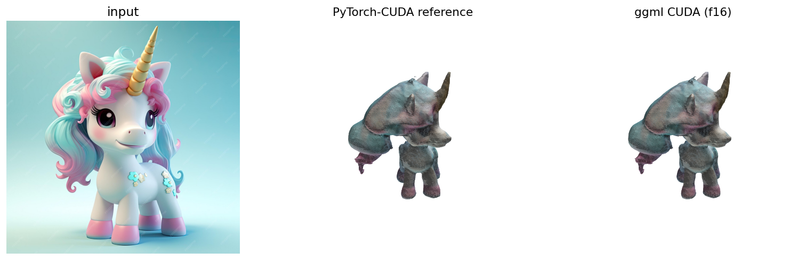
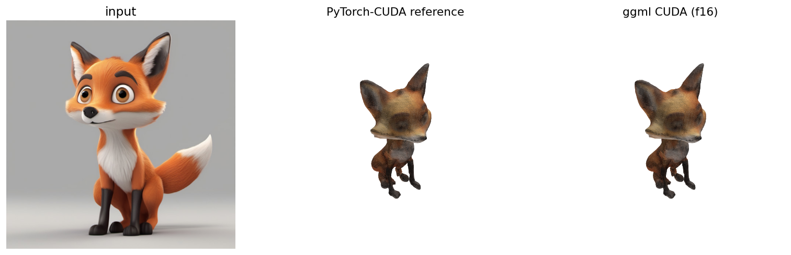
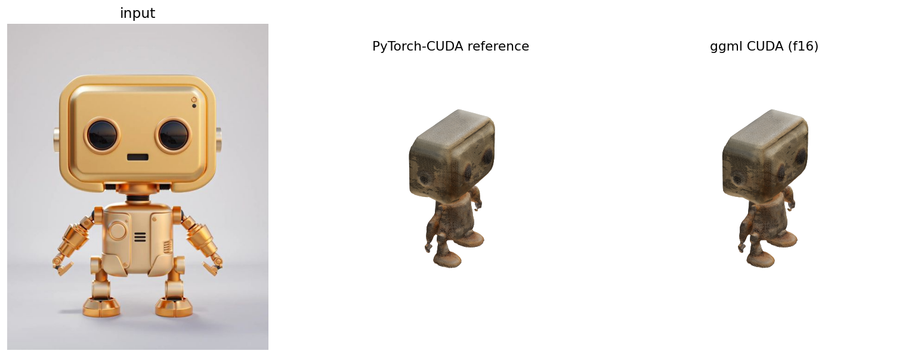
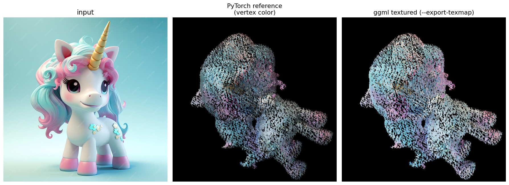
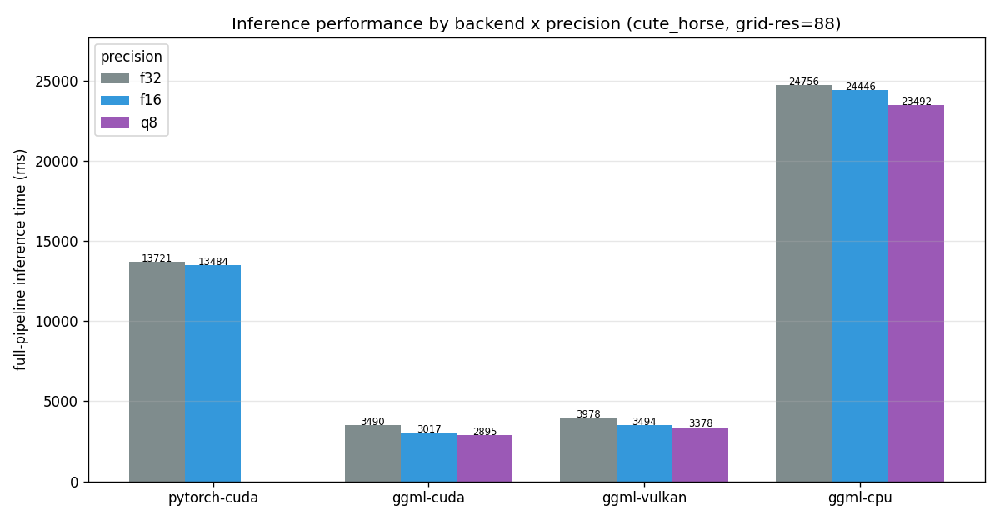
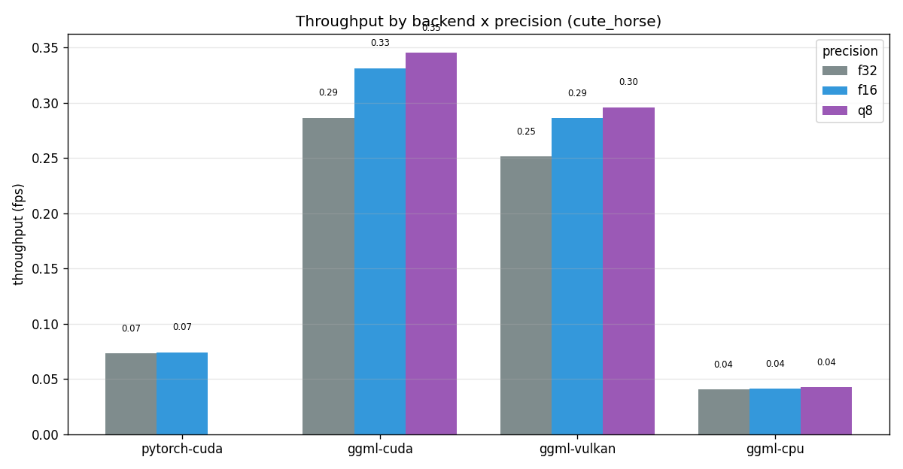

# cpp_ggml — InstantMesh Pure C++ / ggml Inference Engine

This module is a **pure C++ / ggml inference port** of [InstantMesh](https://github.com/TencentARC/InstantMesh) (single image → 3D mesh): the DINO encoder, LRM Triplane Transformer, OSGDecoder and FlexiCubes all run on GGUF (`f32` / `f16` / `q8`) quantized weights. A single codebase runs on **CPU / CUDA / Vulkan** backends with **zero Python / PyTorch runtime dependency** (`ldd` shows no torch).

| | Official Python | This module (C++ / ggml) |
|---|---|---|
| Runtime dependencies | PyTorch + CUDA + xformers | None (single executable + 3 GGUF files) |
| Deployment size | Several GB (conda + torch) | ~800 MB (3 models at f16) |
| CUDA end-to-end (f16, RTX 3060) | 13.5 s | **3.0 s (4.5x speedup)** |
| Peak memory (CUDA f16) | 3725 MB | **1011 MB (3.7x reduction)** |
| Non-NVIDIA GPUs | Not supported | Vulkan backend (AMD/Intel/integrated GPUs) |

> Performance data: RTX 3060 / Ryzen 5950X, grid_res=88, end-to-end including model loading and mesh export.
> See [benchmarks/results/PERFORMANCE.md](benchmarks/results/PERFORMANCE.md) for details.

## 1. How It Works

The information flow of InstantMesh inference, and where each stage is implemented in this module:

```
Input image (already a 224×224 multi-view tensor)
   │
   ├── ① dino            DINOv2 ViT encoder             src/models/dino.cpp
   │        → image token sequence (flash attention)
   │
   ├── ② lrm_transformer 16-layer Triplane Transformer  src/models/lrm_transformer.cpp
   │        → triplane latents [3, C, 96, 96]
   │
   ├── ③ synthesizer     OSGDecoder voxel decoding      src/models/synthesizer.cpp
   │        → SDF / deformation / FlexiCubes weights / RGB per voxel
   │
   ├── ④ flexicubes      SDF → triangle mesh (pure C++, no weights) src/models/flexicubes.cpp
   │
   └── ⑤ texture_map     xatlas UV unwrapping + multi-view baking src/models/texture_map.cpp
            → OBJ + MTL + PNG (optional --export-texmap)
```

- ①②③ are GGUF weight models running on the ggml computation graph (any backend); ④⑤ are host-side C++ algorithms.
- The backend is auto-detected at runtime: GPU (CUDA or Vulkan) first, falling back to CPU otherwise
  (`--device auto|cpu|gpu`, see [src/core/backend.cpp](src/core/backend.cpp)).
- ggml itself is pinned at official v0.21.0 via a submodule; all ggml adaptations of this module are
  stored as patches in [patches/](patches/README.md), applied automatically during CMake configure.

### Directory Layout

```
cpp_ggml/
├── CMakeLists.txt       # Build entry (submodule check + auto patch application)
├── patches/             # ★ ggml adaptation patches (applied by CMake after clone)
├── src/
│   ├── core/            # Backend auto-detection, GGUF loading
│   ├── models/          # dino / lrm_transformer / synthesizer / flexicubes / texture_map(+xatlas)
│   ├── tools/           # CLIs: instantmesh (end-to-end) + per-model test tools
│   └── utils/           # stb_image_write
├── tests/               # ctest regression (backend / ops / texture-map parity)
├── convert/             # ckpt → GGUF conversion + input preprocessing (Python, conversion only)
├── benchmarks/          # parity checks, benchmark scripts and results/ artifacts
├── models/gguf/         # f32 / f16 / q8 weights (.gguf not committed, see §3 for download)
└── third_party/
    ├── ggml/            # ggml submodule (v0.21.0)
    └── RMBG-2.0-GGML/   # rembg foreground segmentation reference (for Zero123++ integration)
```

## 2. Quality & Performance Overview

**Reconstruction quality (per-demo comparison against official PyTorch)**:

| blue_cat | cute_horse | fox | robot |
|----------|------------|-----|-------|
|  |  |  |  |

Full texture-mapping pipeline (input image → official PyTorch → ggml baking):



**End-to-end latency (including loading and export, RTX 3060)**:

| backend | f32 | f16 | q8 |
|---------|-----|-----|----|
| PyTorch CUDA | 13.7 s | 13.5 s | — |
| ggml CUDA | 3.5 s | **3.0 s** | **2.9 s** |
| ggml Vulkan | 4.0 s | 3.5 s | 3.4 s |
| ggml CPU | 24.8 s | 24.4 s | 23.5 s |

| Inference time | Throughput (fps) | Precision loss heatmap |
|----------|--------------|----------------|
|  |  |  |

**Accuracy**: f16 SDF relative error vs f32 is <1%, q8 is ~2–3% (geometry essentially unchanged);
CPU / CUDA / Vulkan agree within <1% at the same precision (see [models/MODEL_CARD.md](models/MODEL_CARD.md)).

---

## 3. Beginner's Guide: From Clone to Your First Mesh

Run the following commands from the repository root (tested on Ubuntu 20.04+; other distros are similar).

### Step 0. Prerequisites

| Dependency | Required? | Notes |
|---|---|---|
| git ≥ 2.20, CMake ≥ 3.18, C++17 compiler (gcc ≥ 9) | Required | `sudo apt install git cmake g++` |
| Python3 + numpy + Pillow | Only for demo preprocessing | `pip install numpy Pillow` |
| CUDA Toolkit ≥ 11.7 (with nvcc) | Optional | Only needed for the CUDA backend; verify with `nvcc --version` |
| Vulkan SDK (with glslc) | Optional | Only needed for the Vulkan backend |
| huggingface_hub | Optional | Convenient for downloading weights; curl also works |

### Step 1. Clone (must include submodules)

```bash
git clone --recurse-submodules https://github.com/Asher-1/InstantMesh-GGML.git
cd InstantMesh-GGML

# If already cloned without --recurse-submodules:
git submodule update --init --recursive
```

Verify: `ls cpp_ggml/third_party/ggml/CMakeLists.txt` should exist.
(If missing, CMake fails immediately with the fix command above.)

### Step 2. Download Model Weights (3 models × 3 precisions)

Weights are hosted on Hugging Face: **https://huggingface.co/Asher-1/InstantMeshGGuf**

```bash
# Option A: pull everything at once (recommended, ~2.7 GB)
pip install -U "huggingface_hub"
huggingface-cli download Asher-1/InstantMeshGGuf \
    --local-dir cpp_ggml/models/gguf

# Option B: pull only the f16 trio (~760 MB, minimal usable set)
mkdir -p cpp_ggml/models/gguf
for f in dino_f16 lrm_transformer_f16 synthesizer_f16; do
  curl -L -o cpp_ggml/models/gguf/$f.gguf \
       https://huggingface.co/Asher-1/InstantMeshGGuf/resolve/main/$f.gguf
done
```

> The three models **must use the same precision** (e.g. all f16). q8 is smaller and faster; f32 is for accuracy benchmarking only.

### Step 3. Build

```bash
# --- Route A: CPU (zero extra dependencies, easiest to get started) ---
cmake -B cpp_ggml/build -S cpp_ggml -DINSTANTMESH_BUILD_TESTS=ON
cmake --build cpp_ggml/build -j

# --- Route B: CUDA (recommended, needs nvcc; 86 = RTX 30 series, adjust for your GPU) ---
cmake -B cpp_ggml/build-cuda -S cpp_ggml -DGGML_CUDA=ON -DCMAKE_CUDA_ARCHITECTURES=86
cmake --build cpp_ggml/build-cuda -j

# --- Route C: CUDA + Vulkan dual backend ---
# Vulkan needs glslc from the SDK to compile shaders; if CMake can't find it, set it explicitly:
export VULKAN_SDK=$HOME/VulkanSDK/1.4.350.0/x86_64          # adjust to your install path
cmake -B cpp_ggml/build-gpu -S cpp_ggml -DGGML_CUDA=ON -DGGML_VULKAN=ON \
      -DCMAKE_CUDA_ARCHITECTURES=86 \
      -DVulkan_GLSLC_EXECUTABLE=/usr/local/bin/glslc
cmake --build cpp_ggml/build-gpu -j
# Note: if multiple CUDA toolkits are installed (e.g. 11.1/11.4/11.8), the exe
# link may resolve the wrong libcudart.so.11.0 and fail with
# "undefined reference to cudaLaunchKernelExC@libcudart.so.11.0". Fix (per-machine):
#   -DCMAKE_EXE_LINKER_FLAGS="-Wl,--disable-new-dtags -Wl,-rpath,/usr/local/cuda/lib64 -L/usr/local/cuda/lib64 /usr/local/cuda/lib64/libcudart.so.11.0"
```

Verify: each build directory produces an `instantmesh` executable; the configure log should show
`ggml patch already applied` / `Applied ggml patch` (the patch mechanism is working).

### Step 4. Run Tests (ctest regression)

```bash
cd cpp_ggml/build && ctest --output-on-failure && cd ../..
# Expected output: 100% tests passed (10 tests: backend / flashattn / mulmat_tiny /
# cont_permute / conv_layout / texture_map / scheduler / clip_vision / vae / unet)
```

### Step 5. First Demo: Image → OBJ Mesh

The C++ side consumes preprocessed multi-view tensors (currently generated from official
zero-shot camera parameters + replicated input images; Zero123++ multi-view diffusion is
being integrated, see the §5 roadmap):

```bash
# 5.1 Generate multi-view inputs (ImageNet-normalized [6,3,224,224] + cameras [6,16])
python3 -m cpp_ggml.convert.prep_input \
    --image examples/robot.jpg --views 6 --out-dir /tmp/robot_input

# 5.2 End-to-end reconstruction (backend auto-detected: GPU if available, else CPU)
cpp_ggml/build/instantmesh \
    --dino cpp_ggml/models/gguf/dino_f16.gguf \
    --transformer cpp_ggml/models/gguf/lrm_transformer_f16.gguf \
    --synthesizer cpp_ggml/models/gguf/synthesizer_f16.gguf \
    --image /tmp/robot_input/image.bin \
    --camera /tmp/robot_input/camera.bin \
    --grid-res 88 --out robot.obj
```

Verify: `head -3 robot.obj` shows `v x y z r g b` vertex lines, which means success
(vertex-colored OBJ, viewable directly in MeshLab / Blender).

### Step 6. Export Texture Map (equivalent of official `--export_texmap`)

```bash
cpp_ggml/build-cuda/instantmesh \
    --dino cpp_ggml/models/gguf/dino_f16.gguf \
    --transformer cpp_ggml/models/gguf/lrm_transformer_f16.gguf \
    --synthesizer cpp_ggml/models/gguf/synthesizer_f16.gguf \
    --image /tmp/robot_input/image.bin --camera /tmp/robot_input/camera.bin \
    --grid-res 88 --export-texmap --texture-res 2048 --out robot_tex.obj
```

Outputs `robot_tex.obj + .mtl + .png` (xatlas UV unwrapping + multi-view baking).

### Step 7. Reproduce the Benchmark (optional)

```bash
# Requires three separate build directories (one per backend, see the header comment
# of benchmarks/run_bench.sh)
bash cpp_ggml/benchmarks/run_bench.sh          # 3 backends × 3 precisions × all demos
python3 cpp_ggml/benchmarks/analyze.py         # generates report.md + charts
```

### FAQ

| Symptom | Cause / Fix |
|---|---|
| CMake reports "ggml submodule not found" | Forgot to init: `git submodule update --init --recursive` |
| configure reports "patch neither applies nor is applied" | ggml worktree conflicts with the patch: restore with `git -C cpp_ggml/third_party/ggml checkout -- .` and retry |
| CUDA build can't find nvcc | Install the CUDA Toolkit and ensure `nvcc` is on PATH |
| Vulkan build fails (glslc) | Set `-DVulkan_GLSLC_EXECUTABLE=/path/to/glslc` explicitly (a newer glslc bundled with the SDK may require a newer glibc; the distro-packaged one is more reliable) |
| f16 slower than f32 on CPU | Known behavior (CPU dequantization overhead); use f32 or q8 on CPU |
| Out of VRAM/memory (grid_res 128) | With 12GB VRAM, use grid_res ≤ 88; switch to q8 weights if memory is short |
| `--device gpu` finds no device | The build doesn't include the corresponding GPU backend (e.g. a CPU-only build dir); use build-cuda / build-gpu |

---

## 4. ggml Adaptation Patch Mechanism

Any modification to ggml in this module **must** be stored as a `.patch` file under
[patches/](patches/README.md) (uncommitted changes in the submodule worktree are not
distributed with the repo, otherwise other developers cannot reproduce them). CMake handles
this automatically at configure time: patch missing → `git apply`; already applied →
idempotent skip; conflict → error and abort. See
[patches/README.md](patches/README.md) for how to generate a new patch.

## 5. Feature Parity with the Official Python Version & Roadmap

| Capability | Status |
|---|---|
| DINO → Triplane → OSGDecoder → FlexiCubes end-to-end | ✅ parity on all 3 backends |
| Vertex-colored OBJ | ✅ Δmean≈0.002 vs PyTorch |
| Texture-map baking (xatlas + multi-view) | ✅ OBJ+MTL+PNG (official has no PBR, no alignment needed) |
| f32 / f16 / q8 precisions | ✅ |
| CUDA / Vulkan / CPU backends | ✅ runtime auto-detection (explicit device via test argv / `--device`) |
| Zero123++ multi-view diffusion (single image → 6 views) | ✅ `zero123pp` tool: scheduler / CLIPVision / VAE / UNet(RefOnly) per-component parity all pass; E2E PSNR acceptance in progress |
| rembg foreground segmentation (BiRefNet, RMBG-2.0) | ✅ `rembg` tool + ggml custom ops patch; not yet chained into the single-command instantmesh pipeline |
| NeuralRender / GLB export | ⏳ planned |

Full technical design and implementation notes: [../docs/PLAN.md](../docs/PLAN.md).

## 6. Developer Quick Reference

- **Weight conversion** (official ckpt → GGUF): `python3 -m cpp_ggml.convert.convert_all`;
  per-model scripts in [convert/](convert/); q8 is quantized from f16.
- **Parity checks**: [convert/parity_*.py](convert/) generate reference activations;
  C++ compares layer by layer with `atol + rtol*|ref|` (threshold 2e-3; ctest skips
  when fixtures are missing).
- **Per-model CLIs**: the tools `dino` / `lrm_transformer` / `synthesizer` / `flexicubes`
  can load and run a single model independently (build artifacts live in the build directory),
  which is handy for layer-by-layer debugging; `zero123pp` runs the multi-view diffusion
  pipeline (see `--fixture-dir` for deterministic replay).
